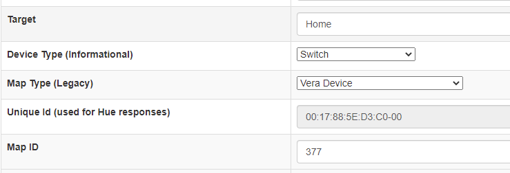

Are you using [HA-Bridge](https://github.com/bwssytems/ha-bridge/) to access your Vera's (or openLuup's) devices, but you're tired of status being out-of-sync?

This plug-in will give you the ability to push updates to your HA-Bridge.

## Installation via MiOS App Store

This plug-in is a beta and is not yet available on App Store.

**Manual installation is recommended.**

## Manual Installation

To install, simply upload the files in the release package, using Vera's feature (Go to *Apps*, then *Develop Apps*, then *Luup files* and select *Upload* - multiple files can be selected when uploading).
To create a new device under Vera, go to *Apps*, then *Develop Apps* and *Create device*.

> If you're under openLuup, you'd already know how to do ;)

- Upnp Device Filename/Device File: *D_HaBridge1.xml*
- Upnp Implementation Filename/Implementation file: *I_HaBridge1.xml*

Then reload luup engine.

You'll need to set the IP of your HA-Bridge instance in the IP attribute under your device's properties. If you're running on a different port than *80*, just specify *IP:port* in the field (ie: *192.168.1.26:8080*).

## How to recognize a device and supported devices

Since HA-Bridge could be used to control different kind of devices, the plug-in will recognize only devices mapped under HA-Bridge as "Vera Device" or "Vera Scene" for "Map Type".



*Map ID* should correspond to Vera's device ID and will be used to correlate the bridge device with the Vera device. This is the standard behaviour if the device is created via HA-Bridge's wizard.

Due to the way Ha-Bridge is handling updates, only lights and dimmers (lights and roller shutters). Colors are unfortunately not supported at the moment.

## Force update

The update is performed by

Just call *UpdateStatus* on *urn:bochicchio-com:serviceId:HaBridge1*.

```
luup.call_action("urn:bochicchio-com:serviceId:HaBridge1", "UpdateStatus", {}, 384)
```

## Use with bridged Veras on openLuup

If you're running the plug-in with a bridged Vera, set *DeviceNumberStartAt* to *10000*.
This will work if you're calling Vera directly for actions (ie: device number *18*), but the plug-in is running on openLuup (where device id will be *10018*) or on a bridge Vera.

If you have more than one bridge or something else giving you different numbering, this setting will make it work regardless of the mapped id.